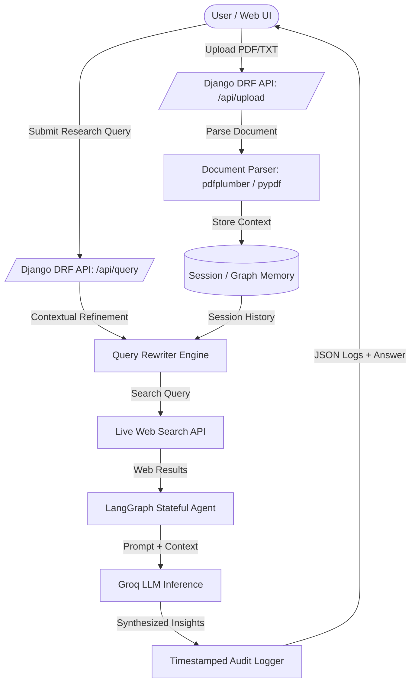

# 🎯 CounterPoint

> **Real-Time Competitive Intelligence & Strategy Alignment Agent**

CounterPoint is an AI-powered competitive analysis platform built with **Django REST Framework**, **LangGraph**, **Groq LLM**, and **Vite**. It enables product managers, strategists, and market researchers to perform real-time web research on competitors and compare live market data against uploaded internal positioning documents (PDF/TXT).

---

## ✨ Features

- **🌐 Live Web Competitor Research**: Automatically queries live web search engines to extract competitor offerings, pricing strategies, market positioning, and recent activity.
- **📄 Internal Positioning Document Analysis**: Supports PDF and TXT file uploads (`pdfplumber` / `pypdf`) to analyze internal positioning guidelines, battlecards, and product strategy context.
- **🧠 Stateful Agent Memory (LangGraph)**: Maintains conversational graph state (`StateGraph` + `MemorySaver`) across multi-turn sessions, ensuring follow-up queries refine previous research without loss of context.
- **🔍 Coreference Resolution Engine**: Integrates a `QueryRewriter` service that intelligently resolves context-dependent follow-up questions (e.g., *"How does our pricing compare to theirs?"*) into fully qualified search queries.
- **⚡ Multi-Hop Reasoning & Synthesis**: Leverages **Groq API** high-throughput inference to synthesize complex multi-source insights combining live web results and uploaded strategy files.
- **📜 Transparent Audit Trail**: Every background tool call (web search, document parsing, synthesis) is logged with precise ISO 8601 timestamps, inputs, execution times, and status.
- **📱 Responsive Single-Page UI**: Clean, mobile-first interface designed with vanilla CSS grid/flexbox and dynamic viewports (mobile, tablet, desktop).

---

## 🏗 Architecture & Data Flow



---

## 🛠 Tech Stack

### Backend
- **Framework**: Python 3.11+, Django 5.x, Django REST Framework (DRF)
- **AI / Agent Framework**: LangGraph (`StateGraph`, `MemorySaver Checkpointer`), LangChain Core
- **LLM Engine**: Groq API Python SDK
- **Document Processing**: `pdfplumber`, `pypdf`
- **Web Search**: Custom search integration (`duckduckgo-search` / REST APIs)
- **CORS & Middleware**: `django-cors-headers`

### Frontend
- **Build Tool**: Vite
- **UI Framework**: HTML5, Vanilla JavaScript, Custom CSS Grid/Flexbox Design System
- **Testing**: Vitest (`npm run test`)

---

## 🚀 Getting Started

### Prerequisites
- **Python**: v3.11+
- **Node.js**: v18+ and `npm`
- **Groq API Key**: Obtainable from [Groq Console](https://console.groq.com/)

---

### 1. Backend Setup

1. **Navigate to the backend directory:**
   ```bash
   cd backend
   ```

2. **Create and activate a virtual environment:**
   - **Windows (PowerShell):**
     ```powershell
     python -m venv venv
     .\venv\Scripts\Activate.ps1
     ```
   - **macOS/Linux:**
     ```bash
     python3 -m venv venv
     source venv/bin/activate
     ```

3. **Install Python dependencies:**
   ```bash
   pip install -r requirements.txt
   ```

4. **Configure Environment Variables:**
   Create a `.env` file in the project root or backend directory (refer to `.env.example`):
   ```env
   SECRET_KEY=your-django-secret-key
   DEBUG=True
   CORS_ALLOWED_ORIGINS=http://localhost:5173,http://127.0.0.1:5173
   GROQ_API_KEY=your_groq_api_key_here
   ```

5. **Run Django Migrations:**
   ```bash
   python manage.py migrate
   ```

6. **Start the Django Development Server:**
   ```bash
   python manage.py runserver
   ```
   The backend API will run on `http://127.0.0.1:8000/`.

---

### 2. Frontend Setup

1. **Navigate to the frontend directory:**
   ```bash
   cd frontend
   ```

2. **Install Node dependencies:**
   ```bash
   npm install
   ```

3. **Start the Vite Development Server:**
   ```bash
   npm run dev
   ```
   The frontend client will run on `http://localhost:5173/`.

---

## 🧪 Running Tests

### Backend Unit Tests
Run Django backend tests for API endpoints, session memory, query rewriter, and synthesis engine:
```bash
cd backend
python manage.py test api
```

### Frontend Tests
Run Vitest integration and unit tests:
```bash
cd frontend
npm run test
```

---

## 📁 Repository Structure

```
counter-point/
├── backend/
│   ├── api/
│   │   ├── services/
│   │   │   ├── audit_logger.py             # ISO-timestamped tool call logging
│   │   │   ├── document_parser.py          # PDF / TXT extraction service
│   │   │   ├── groq_engine.py              # Groq LLM client integration
│   │   │   ├── langgraph_memory_engine.py  # LangGraph checkpointer & memory state
│   │   │   ├── query_rewriter.py           # Coreference resolution engine
│   │   │   ├── session_manager.py          # Session state management
│   │   │   ├── synthesis_engine.py         # Multi-hop prompt synthesis
│   │   │   └── web_search.py               # Live web research module
│   │   ├── tests/                          # Backend test suites
│   │   ├── serializers.py                  # DRF request/response serializers
│   │   ├── urls.py                         # API endpoint routing
│   │   └── views.py                        # API view logic
│   ├── counterpoint/                       # Django project configuration
│   ├── manage.py
│   └── requirements.txt
├── frontend/
│   ├── index.html                          # Main HTML entry point
│   ├── package.json                        # Node dependencies & scripts
│   ├── vite.config.js                      # Vite server configuration
│   └── src/                                # Frontend JavaScript, CSS, & tests
├── specs/                                  # Project specs, mission, and architecture docs
├── .env.example                            # Environment variables template
└── README.md                               # Project documentation
```

---

## 📝 License

This project is licensed under the MIT License.